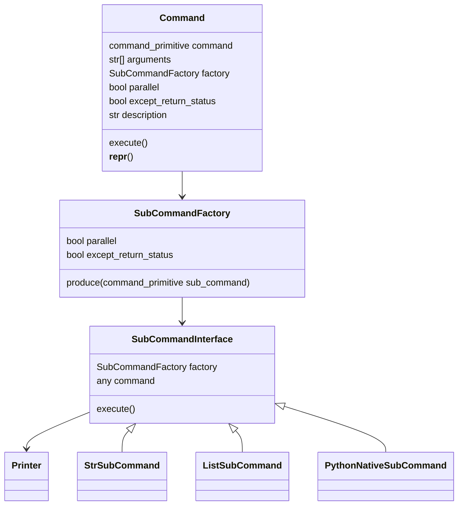

# Purpose
This project aims to act as an easily customizable shell command tool that is capable of both aliasing and running workflows.  
It can run workflows of multiple commands with arguments such running commands in parallel and stopping or not stopping when a command returns with an error code.

# Quick start
1) Run "python -m exec.main" to get the help text and list of available commands.
2) To run a command, write e.g. "python -m exec.main test-print"
3) To view what a command would execute, write e.g. "python -m exec.main test-print --print"
4) Open generate_commands.py, use some existing command as a template and start automating your tasks!

# Config
The software is customized via generate_commands.py file where generate_commands function returns the commands dict.  
Commands dict:
* Key: command names (which the user can write to shell)  
* Values: command objects have "command" property. This is executed either in the shell (strings) or python (functions, methods). Lists are used to chain and nest commands.

# Security
WARNING: This script executes subprocess with a shell.  
It does not automatically validate shell inputs and thus should only be used locally.  
Otherwise this opens up a shell command injection vulnerability.

# Program architecture (aspirational diagram)

# Other notes
## NPM code quality setup
"devDependencies": {
    "@typescript-eslint/eslint-plugin": "^5.2.0",
    "@typescript-eslint/parser": "^5.2.0",
    "eslint": "^7.32.0",
    "eslint-plugin-import": "^2.24.2",
    "prettier": "^2.4.1",
    "typescript": "^4.4.4"
}
